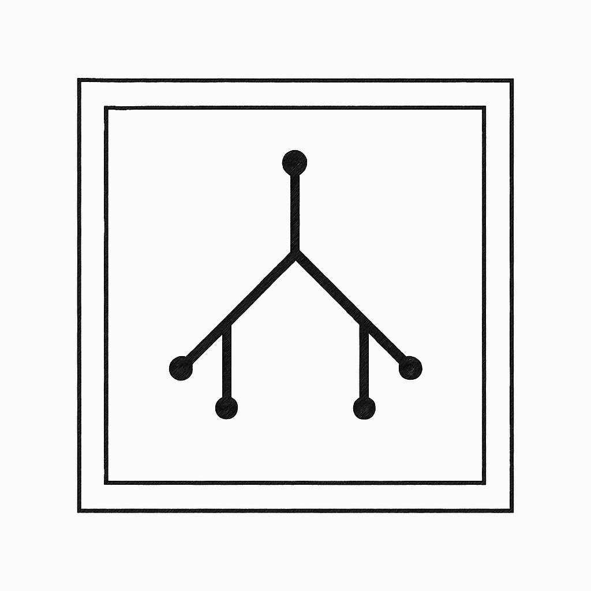

# Concept Tracer - AI-Powered Intellectual Genealogy

<p align="center">
  
</p>

## 🌐 Try It Online

**[Visit the Concept Tracer Website](https://simonkral1.github.io/genealogy-tracer/)**

- **Web Interface**: Experience Concept Tracer directly in your browser
- **Chrome Extension**: Download for seamless webpage integration
- **Learn More**: Explore the genealogical method and see examples

Experience the power of intellectual genealogy through a clean, scholarly interface inspired by academic research.

Explore the genealogy of ideas

Concept Tracer is an AI-powered tool that reveals the intellectual genealogy of ideas through a sophisticated RAG (Retrieval-Augmented Generation) architecture. Built on Cloudflare Workers and powered by Claude Opus 4, it combines Wikipedia's knowledge base with structured XML prompting to generate historically-grounded conceptual genealogies.

Unlike simple AI summaries, Concept Tracer employs a multi-stage pipeline: Wikipedia API search → context enrichment → structured LLM prompting → XML parsing → streaming delivery. Each genealogy traces 5 pivotal works with 80-word explanations of their paradigm shifts, complete with verifiable sources.

The innovative "Reinterpret" feature generates alternative genealogies by instructing the model to explore different intellectual traditions, geographic regions, or disciplinary perspectives—actively undermining any single narrative and embodying Nietzschean genealogical method in code.

## 📥 Download Extension

**[⬇️ Download Concept Tracer Early Alpha v0.1](./concept-tracer-extension-v0.1.zip)**

### Quick Install:
1. Download the extension file above
2. Go to `chrome://extensions/` in Chrome
3. Enable "Developer mode" (top right toggle)
4. Drag and drop the downloaded file onto the page
5. Select text on any webpage and press `Ctrl+Shift+G` (or `Cmd+Shift+G` on Mac)

## ✨ Key Features

### 🔍 **Intelligent Genealogy Tracing**
- **Instant Analysis**: Trace any concept's intellectual history in seconds
- **Scholarly Sources**: Each entry includes primary sources and authoritative references
- **Chronological Evolution**: See how ideas transformed across time and contexts
- **80-Word Explanations**: Concise, impactful insights that capture key paradigm shifts

### 🔄 **Reinterpret Functionality** 
- **Alternative Perspectives**: Generate completely different genealogies from various intellectual traditions
- **Multiple Angles**: Explore geographic, disciplinary, or cultural alternatives to mainstream narratives
- **Comparative Analysis**: See how different schools of thought approach the same concept

### 🎯 **Advanced Interaction**
- **Recursive Exploration**: Every result can be traced further, creating chains of investigation
- **Expand Analysis**: Get detailed analysis of any genealogical entry with one click
- **Copy & Export**: Save formatted results for research and note-taking
- **Smart Caching**: Previously traced concepts load instantly from local storage

### 🌐 **Seamless Integration**
- **Non-Intrusive Interface**: Minimalist popup that enhances your reading experience
- **Multiple Access Methods**: Right-click menu, keyboard shortcut, or toolbar icon
- **Real-Time Streaming**: Results appear as the AI processes your query
- **Cross-Platform**: Works on any website, from Wikipedia to academic journals

## 🚀 How to Use

### Browser Extension
1. **Install**: Download and install the Chrome extension
2. **Select Text**: Highlight any word or phrase on a webpage
3. **Activate**: Press `Ctrl+Shift+G` (or `Cmd+Shift+G` on Mac) or right-click → "Trace Genealogy"
4. **Explore**: View genealogy, click "trace" to go deeper, or "reinterpret" for alternative perspectives
5. **Research**: Use "expand" for detailed analysis and "copy" to save your findings

### Web Interface
1. **Visit**: Go to [simonkral1.github.io/genealogy-tracer](https://simonkral1.github.io/genealogy-tracer/)
2. **Enter Concept**: Type any concept or idea you want to trace
3. **Analyze**: View the genealogy with sources, years, and explanations
4. **Reinterpret**: Generate alternative genealogies from different intellectual perspectives

## 🎯 Perfect For

- **Students** researching papers with historical depth and alternative perspectives
- **Academics** exploring intellectual history and comparative approaches
- **Writers** understanding the genealogical weight and contested nature of concepts
- **Researchers** investigating how ideas emerged and evolved across traditions
- **Anyone** curious about the contingent history behind taken-for-granted concepts

## 🔧 Technical Architecture

### AI-Powered Analysis
- **Streaming Responses**: Real-time genealogy generation with status updates
- **XML-Based Parsing**: Reliable extraction of structured genealogical data
- **Multiple LLM Endpoints**: `/stream` for genealogies, `/reinterpret` for alternatives, `/expand` for detailed analysis
- **Wikipedia Integration**: Leverages scholarly databases for authoritative sources

### Privacy & Performance
- **Local Caching**: Results stored in browser for 24 hours, no permanent tracking  
- **Secure Processing**: Queries processed securely with no permanent storage
- **Optimized Performance**: Fast streaming responses with intelligent caching
- **Cross-Origin Support**: Works seamlessly across all websites

### Core Infrastructure
- **Cloudflare Workers**: Serverless edge computing for low-latency, globally distributed API endpoints
- **Claude Opus 4 (opus-4-20250514)**: Advanced language model for nuanced intellectual history analysis
- **Streaming SSE (Server-Sent Events)**: Real-time data transmission for responsive user experience
- **TypeScript + Vitest**: Type-safe development with comprehensive test coverage

### AI & Knowledge Engineering
- **Structured XML Prompting**: Enforces consistent output format through XML schema validation
  ```xml
  <genealogy>
    <item>
      <title>Work Title</title>
      <year>YYYY</year>
      <url>https://source.url</url>
      <explanation>Paradigm shift explanation (80 words max)</explanation>
    </item>
  </genealogy>
  ```
- **RAG-like Architecture**: Retrieval-Augmented Generation using Wikipedia API for grounding
  - Wikipedia search API integration for source material
  - Context injection into prompts for factual accuracy
  - Reduces hallucination through empirical grounding
- **Multi-Stage Processing Pipeline**:
  1. Query → Wikipedia API search (3-5 results)
  2. Context enrichment → Structured prompt generation
  3. LLM processing → XML response parsing
  4. Stream transformation → Client delivery

### Advanced Features Implementation

#### Reinterpret Mechanism
- **Algorithmic Approach**: Not just prompt variations, but systematic exploration of alternative intellectual traditions
- **Context Preservation**: Maintains original genealogy while generating contrasting perspectives
- **Differential Analysis**: Explicitly instructs model to avoid overlap with initial interpretation
- **Structured Alternatives**: Explores different geographic regions, disciplinary lenses, and philosophical schools

**Implementation Example:**
```typescript
// Reinterpret endpoint receives original genealogy
const prompt = `You are a brilliant intellectual historian providing an ALTERNATIVE GENEALOGY of the concept "${query}".

Here is the ORIGINAL GENEALOGY that was previously constructed:
${existingItems}

Your task: Create a completely different 5-item genealogy that explores alternative aspects, 
traditions, or intellectual lineages of the same concept. Focus on different approaches, 
geographic regions, disciplinary perspectives, or historical trajectories.

Guidelines:
- Each explanation should be under 80 words
- Focus on works that offer genuinely different perspectives from the original genealogy
- Arrange chronologically, showing alternative intellectual evolution`;
```

This ensures the reinterpretation is not random but systematically explores intellectual diversity.

#### Streaming Architecture
- **Chunked Response Processing**: Parses incomplete XML streams in real-time
- **Progressive Enhancement**: Items appear as they're generated, not after full completion
- **Error Resilience**: Continues processing even with malformed chunks
- **Deduplication Logic**: Prevents duplicate items through content hashing

### Data Sources

Concept Tracer integrates multiple knowledge sources to enrich genealogies with structured data:

#### Wikipedia API
- **Primary Knowledge Base**: Main source for concept context and historical information
- **Search Integration**: Retrieves 3-5 relevant articles per query
- **Source Grounding**: Reduces AI hallucination through empirical references
- **Real-time Access**: Live queries to Wikipedia's API for up-to-date information

#### Wikidata SPARQL
- **Scholarly Metadata**: Enriches genealogies with structured academic work data
- **Entity Linking**: Connects concepts to Wikidata's knowledge graph
- **Publication Discovery**: Finds papers, books, and articles about specific concepts
- **Metadata Extraction**: Retrieves titles, authors, publication years, and URLs
- **Query Performance**: ~700-1500ms per concept with 20-work limit
- **Graceful Degradation**: Returns empty results on failures without breaking genealogies

The Wikidata integration uses SPARQL queries to discover works where the concept is tagged as the main subject (property P921), providing verifiable scholarly sources that complement the AI-generated historical narratives.

For detailed technical documentation, see [Wikidata Integration Guide](./trace-worker/red-heart-d66e/docs/wikidata-integration.md).

### Security & Privacy
- **No User Tracking**: Zero persistent user data storage
- **API Key Security**: Cloudflare secrets management for API credentials
- **CORS Configuration**: Properly configured for extension and web access
- **Input Sanitization**: Protection against prompt injection attacks


## 🧭 Philosophical Approach

### Avoiding the "Oracle Problem"
Concept Tracer is designed as a **tool for inquiry, not truth**:

1. **Explicit Contingency**: Every result emphasizes the constructed nature of genealogies
2. **Multiple Perspectives**: The reinterpret function actively undermines singular narratives
3. **User Agency**: Encourages recursive exploration rather than passive consumption
4. **Source Transparency**: Always provides verifiable references, never claims of absolute truth

### Interface Design Philosophy
- **Epistemic Humility**: UI includes subtle reminders like "One possible genealogy" 
- **Invitation to Critique**: "Reinterpret" button prominently displayed
- **Scholarly Aesthetic**: Minimalist design emphasizes serious intellectual work
- **Progressive Disclosure**: Complexity revealed through interaction, not overwhelming initially


## 📦 Development Setup

```bash
# Clone this repository
git clone https://github.com/your-username/genealogy-ai.git
cd genealogy-ai

# For local development, serve the web interface
python3 -m http.server 8000

# Extension files are ready to load in Chrome developer mode
# Just drag concept-tracer-extension-v0.1.zip onto chrome://extensions/
```

## 🤝 Contributing

We welcome contributions to advance genealogical thinking in the digital age! Whether it's new features, bug fixes, or theoretical improvements to the genealogical method.

## 📄 License

MIT License - See LICENSE file for details

---

*"There are no facts, only interpretations." — Nietzsche*

**Concept Tracer operationalizes Nietzsche's genealogical method for the digital age, using AI as a partner in truth-seeking, not an oracle of it.**
